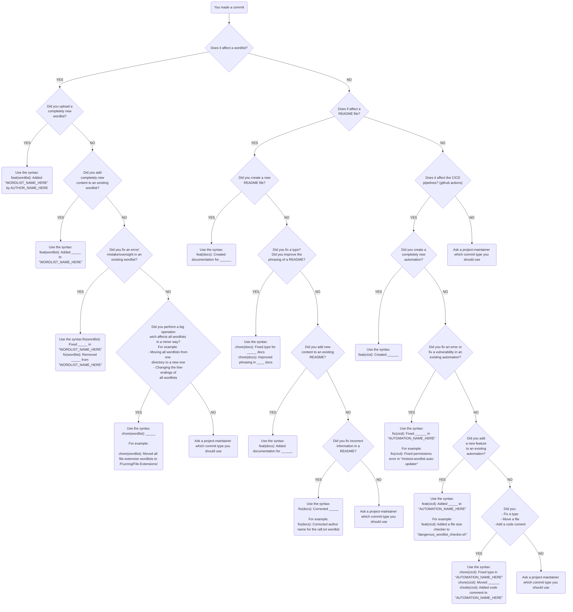

## Contributing

If you have any ideas for things we should include, please use ONE of the following methods to submit them:

* Create a pull request
* Create an issue in the project (with links, and we'll parse and incorporate them)

Significant effort SHOULD be made to give attribution for these lists whenever possible, and if you are a list owner or know who the original author/curator is, please let us know so we can give proper credit.

## Folder naming scheme

Folders should be named with the train case scheme, for example `File-System`.

## Conventional Commits

All commits related to contributions to seclists are encouraged to use the [Conventional-Commits v1.0.0](https://www.conventionalcommits.org/en/v1.0.0/) syntax

> The Conventional Commits specification is a lightweight convention on top of commit messages. It provides an easy set of rules for creating an explicit commit history; which makes it easier to write automated tools on top of. This convention dovetails with SemVer, by describing the features, fixes, and breaking changes made in commit messages.
>
> The commit message should be structured as follows:
```xml
<type>[optional scope]: <description>

[optional body]

[optional footer(s)]
```

For example:
```
feat(wordlist): Added "raft" wordlists by Google
```

Below is a flowchart which should assist you in selecting the best conventional-commits syntax for the commit messages of the contributions you wish to make.



## READMEs

If you are uploading a brand-new wordlist into SecLists, an entry must be added to the containing folder's `README.md`. If the folder does not already have a `README.md` file, you may create one.

These are the general guidelines for writing READMEs in SecLists:
1. Use the filename of the wordlist as the title. This will help other people more easily locate which entries in the README correspond to the wordlist you've uploaded.
2. If the wordlist is very purpose-specific, consider adding a `Use for:` text, right below the entry title. For example: 
> ## vulnerability-scan_j2ee-websites_WEB-INF.txt
> Use for: Discovering sensitive J2EE files, allowing for exploitation of an LFI.

3. Always include a link to the source of the wordlist: `Source: example.com/the-great-wordlist`
4. If the author shared the wordlist through a blogpost, include a link to it: `Reference: example.com/how-i-hacked-xyz-with-a-wordlist`. This will help SecLists users more easily understand the practical applications of the wordlists you've uploaded.

You can use the README in the folder [Web-Content](Discovery/Web-Content) as a general reference.
